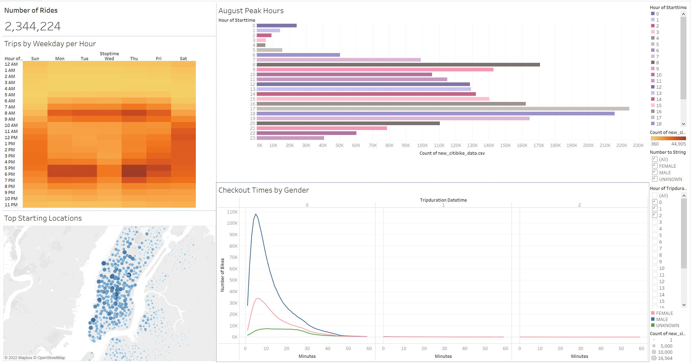

# bikesharing

##Overview
The purpose of this analysis was to create visual data analysis of citibike
users and usage for the month of August, 2019. 

##Results
* Mosts citibike users use the bikes for less than 30 minuets. 
* Most starting locations for bike users appear in lower and mid Manhattan
between the times of 8am, and 5-6pm.

##Summary
Citibike had over 2.3 million users in August, 2019. The majority of 
bike riders were men who had a subscription with the company. The most 
popular times of bike usage were during the morning and evening rush 
hours of 8am and 5-6PM. The count of each bike's tripduration should 
also be factored in to ensure the proper maintenance of each bike. The 
best times to repair bikes would be between 1:00-4:00AM. Data that would 
be useful to have would be how many citibike stations there are by location. 
Seeing a map of this would be helpful in determining a more accurate top 
start and end locations, as well as user count and total number of rides.  
[LINK TO FINAL PRESENTATION STORY](https://public.tableau.com/app/profile/caitlin.kanchanda/viz/NYCCitiBikeAnalysis_16637142542160/NYCCitiBikesAnalysis?publish=yes)